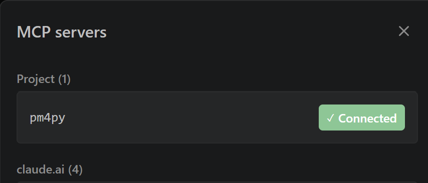
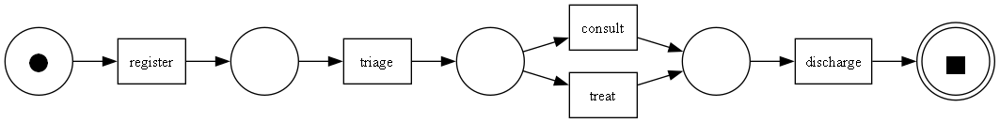
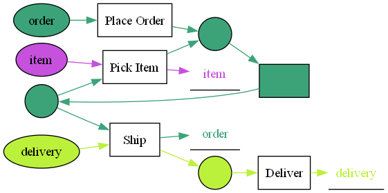

# pm4py-mcp

An AGPL-licensed, stdio-first **Model Context Protocol** server that wraps [PM4Py](https://github.com/process-intelligence-solutions/pm4py) behind a small handle-based tool surface — making research-grade process mining available to Claude and any MCP-capable agent, locally and on open standards (XES, **OCEL 2.0**, BPMN, PNML).

> **Status:** Phase 3 shipped — `pm4py-mcp 0.3.1` ships **48 workflow-shaped tools + 6 curated prompts** spanning I/O, discovery, conformance, filtering, statistics, visualization, OCEL 2.0 object-centric process mining, **textual abstractions** the LLM can reason over, **domain-context injection**, and **Markdown report rendering**. Installable via `uvx pm4py-mcp`. (0.3.1 adds the `PM4PY_MCP_CWD_HINT` env var for relative-path resolution + prompt-template polish driven by Sepsis dogfooding.)

**Today** — load XES / CSV / Parquet logs or OCEL 2.0 (JSON / XML / SQLite), discover Petri nets / process trees / BPMN / DFGs / object-centric Petri nets / OC-DFGs, run token-replay or alignment conformance, filter chains, render dual-channel PNG + SVG — and now **turn every artifact into a textual abstraction the LLM can read directly**, **register domain SOPs that prompts respect across the session**, and **render a final Markdown report from accumulated findings**. 48 natural-language tools + 6 slash-command prompts, fully local, nothing leaves your machine.

**Next (0.4.0)** — advanced discovery (DECLARE, POWL, log skeleton, organizational mining), model conversions (Petri ↔ BPMN ↔ Process Tree ↔ POWL), simulation (`play_out`), dotted chart + performance spectrum, plus the matching `abstract_declare` / `abstract_log_skeleton` / `abstract_temporal_profile` tools. Team deployment via Streamable HTTP lands in Phase 4.

## Why

No open-source MCP server for process mining exists today. Celonis, SAP Signavio, and Microsoft Power Automate Process Mining all ship closed, SaaS-bound equivalents — and **none of them support OCEL 2.0**. `pm4py-mcp` fills the open, local, Python-native quadrant: event logs never leave the machine, algorithms are research-grade (Inductive Miner variants, alignments, OCEL 2.0, object-centric Petri nets), and the server composes cleanly into LangGraph / CrewAI / AutoGen crews.

## Install

### Prerequisites

- **Python 3.10–3.13** via [`uv`](https://docs.astral.sh/uv/)
- **Graphviz** — `dot` must be on PATH for visualization tools.
  - Windows: `winget install Graphviz.Graphviz`
  - macOS: `brew install graphviz`
  - Ubuntu: `sudo apt install graphviz`
- **Optional `[ocel]` extra** — only needed for relational (parquet-backed) OCELs. `pip install 'pm4py-mcp[ocel]'` or `uvx --with 'pm4py-mcp[ocel]' pm4py-mcp`. JSON-OCEL, XML-OCEL, and SQLite-OCEL work without it.

### Claude Desktop / Claude Code configuration

MCP users configure servers via JSON, not via `pip install`. Add this to `claude_desktop_config.json` (or your Claude Code MCP settings):

```jsonc
{
  "mcpServers": {
    "pm4py": {
      "command": "uvx",
      "args": ["pm4py-mcp@latest"],
      "env": {
        // Optional but strongly recommended — resolves relative paths (e.g.
        // "examples/benchmarks/sepsis.xes.gz") against your project root when the
        // server's own CWD isn't under it. Works in Claude Code / Desktop / most IDEs.
        "PM4PY_MCP_CWD_HINT": "${workspaceFolder}"
      }
    }
  }
}
```

Quit Claude Desktop from the system tray (not just close the window) and relaunch. The server auto-downloads on first use.

Once the MCP client picks up the config, `pm4py` shows up as a connected server:



## Walking examples

### Traditional log — `examples/running-example.xes`

> "Load the log at `<path>/examples/running-example.xes`. Describe it. Discover a Petri net with 0.2 noise threshold. Check conformance with token replay. Show me the diagram."

Claude will chain `load_event_log` → `describe_log` → `discover_petri_net` → `conformance_token_replay` → `visualize_petri_net`, returning an inline Petri-net PNG plus the fitness number and absolute file paths for the PNG + SVG. The [bundled example log](examples/running-example.xes) is an 8-case hospital-admission process with two variants:



Token-replay conformance against this model returns `mean_trace_fitness = 1.0` (8/8 fit cases).

### Object-centric log — `examples/order-management.jsonocel`

> "Load `<path>/examples/order-management.jsonocel`. What object types are in it? Flatten it by `order` and discover a Petri net from that view. Now discover the object-centric Petri net across all object types and show me the diagram."

Claude chains `load_ocel` → `describe_ocel` → `flatten_ocel(object_type="order")` → `discover_petri_net` (Phase 1 tool on the flattened log) → `discover_oc_petri_net` → `visualize_oc_petri_net`. The OCPN shows three color-separated flows (order, item, delivery) sharing the `Pick Item` and `Ship` transitions — multi-object interactions that a flattened log would lose:



The [bundled OCEL](examples/order-management.jsonocel) is a 3.7 KB synthetic order-management process with 3 object types (order, item, delivery), 10 events, 8 objects.

### Try it on a real log

The bundled examples are tiny by design. To try pm4py-mcp on real-sized public logs, run the downloader script once (stdlib-only, no extra deps):

```bash
uv run python scripts/download_benchmark_logs.py --list          # show available benchmarks
uv run python scripts/download_benchmark_logs.py sepsis          # ~200 KB — hospital sepsis pathway (default)
uv run python scripts/download_benchmark_logs.py bpi2012         # ~3 MB — loan applications
uv run python scripts/download_benchmark_logs.py bpi2017         # ~28 MB — richer loan-application log
uv run python scripts/download_benchmark_logs.py all             # all three
```

Files land in `examples/benchmarks/` (gitignored — the script is idempotent and MD5-verifies on download). Then in Claude:

> "Load the log at `examples/benchmarks/sepsis.xes.gz`. Describe it, then discover a Petri net and show me the diagram."

Sepsis is the canonical teaching log: **1050 cases, 15214 events, 16 activities** of a real hospital sepsis pathway from 2013–2015 (Mannhardt 2016).

### Prompt-driven: `/new_log_onboarding` on a real log

Once a benchmark log is downloaded, the fastest way to see 0.3.0's agentic layer is a slash command:

> `/new_log_onboarding examples/benchmarks/sepsis.xes.gz`

Claude chains `load_event_log` → `describe_log` → `abstract_log_features` → `abstract_log_attributes` → `abstract_variants` and writes a ≤300-word first-impression summary covering case count, activity spread, dominant variants, and anomalies — in **one turn**, no manual tool chaining. This is the same prompt library 0.3.0 ships six canonical entries for: `/new_log_onboarding`, `/conformance_workflow`, `/bottleneck_analysis`, `/variant_exploration`, `/ocel_flattening_workflow`, `/executive_summary`.

## Tool catalog (Phase 1 + 2 + 3 — 48 tools)

All tools accept a handle (`log_id`, `petri_id`, `ocel_id`, …) or — for `load_*` tools — a file path. None returns the log itself; responses are always compact summaries plus new handles.

### Traditional log I/O (4)
| Tool | Purpose |
|---|---|
| `load_event_log(path, format?, *_key?)` | Read XES / CSV / Parquet; returns `log_id` + summary. |
| `describe_log(log_id)` | Recompute the summary for a loaded log. |
| `export_log(log_id, format, path)` | Write XES or CSV back out. |
| `list_workspace()` | Enumerate derived artifacts in `~/.pm4py-mcp/workspace/`. |

### OCEL 2.0 I/O + the flatten bridge (4)
| Tool | Purpose |
|---|---|
| `load_ocel(path)` | Read JSON-OCEL / XML-OCEL / SQLite-OCEL; returns `ocel_id` + per-type summary. |
| `describe_ocel(ocel_id)` | Object types, per-type event counts, activities preview, time range. |
| `flatten_ocel(ocel_id, object_type)` | **Composability bridge** — projects to a traditional `log_id` usable by every Phase 1 tool. |
| `export_ocel(ocel_id, format, path)` | Write JSON-OCEL / XML-OCEL / SQLite back out. |

### Statistics (4)
| Tool | Purpose |
|---|---|
| `get_variants(log_id, top_k)` | Most-common trace variants and counts. |
| `get_start_end_activities(log_id)` | First/last activity frequency dicts. |
| `get_case_durations(log_id)` | Min/max/mean/median + p50/p75/p90/p95/p99. |
| `get_cycle_time(log_id)` | Average inter-completion delay. |

### Traditional discovery (4)
| Tool | Purpose |
|---|---|
| `discover_dfg(log_id)` | Directly-follows graph. |
| `discover_petri_net(log_id, algorithm, noise_threshold)` | Inductive / Heuristics / Alpha miner. |
| `discover_process_tree(log_id, noise_threshold)` | Process tree via Inductive Miner. |
| `discover_bpmn(log_id, noise_threshold)` | BPMN via Inductive Miner + conversion. |

### OCEL discovery (2)
| Tool | Purpose |
|---|---|
| `discover_ocdfg(ocel_id)` | Object-centric directly-follows graph. |
| `discover_oc_petri_net(ocel_id, variant)` | Object-centric Petri net. `variant` ∈ `{im, imd}`. |

### Conformance (2)
| Tool | Purpose |
|---|---|
| `conformance_token_replay(log_id, petri_id)` | Fast token-based fitness check. |
| `conformance_alignments(log_id, petri_id, multi_processing?)` | Alignment-based fitness. Async; emits progress for long runs. |

### Traditional filtering (5)
All filter tools mint a **new** `log_id` — the original is untouched, so filter chains keep every intermediate handle.

| Tool | Purpose |
|---|---|
| `filter_variants(log_id, top_k \| variants, retain)` | Keep/drop by variant. |
| `filter_time_range(log_id, start, end, mode)` | ISO-8601 time window with 7 mode options. |
| `filter_attribute_values(log_id, attribute, values, retain, level)` | Event- or case-level attribute filter. |
| `filter_case_size(log_id, min_size, max_size)` | By event count per case. |
| `filter_case_performance(log_id, min_seconds, max_seconds)` | By end-to-end case duration. |

### OCEL filtering (4 — consolidated)
Four tools wrap 7 PM4Py filter functions via `level` / `strategy` dispatch. Each mints a fresh `ocel_id`.

| Tool | Purpose |
|---|---|
| `filter_ocel_time_range(ocel_id, start, end)` | Time-window filter; accepts ISO-8601. |
| `filter_ocel_attribute(ocel_id, attribute, values, level, retain)` | `level` ∈ `{event, object}`. |
| `filter_ocel_object_types(ocel_id, types, retain)` | Keep or drop whole object types. |
| `filter_ocel_cc(ocel_id, strategy, value, retain)` | Connected-component filter. `strategy` ∈ `{activity, object, otype, length}`. |

### Traditional visualization (4)
Each viz tool saves **both PNG and SVG** to `~/.pm4py-mcp/workspace/`, returns a caption with absolute paths, and embeds the PNG inline when it fits under ~700 KB.

| Tool | Purpose |
|---|---|
| `visualize_petri_net(petri_id)` | Render a Petri net. |
| `visualize_dfg(dfg_id)` | Render a DFG. |
| `visualize_process_tree(tree_id)` | Render a process tree. |
| `visualize_bpmn(bpmn_id)` | Render a BPMN diagram. |

### OCEL visualization (2)
| Tool | Purpose |
|---|---|
| `visualize_ocdfg(ocdfg_id)` | Render an OC-DFG — edges colored per object type. |
| `visualize_oc_petri_net(ocpn_id)` | Render an OCPN — per-type places and cross-type shared transitions. |

### Textual abstractions (9)
Every abstraction returns `{content, approx_tokens, truncated, source_handle, tool}` so Claude can reason over the text instead of a PNG it can't read. Uses `pm4py.algo.querying.llm.abstractions.*_to_descr` under the hood.

| Tool | Purpose |
|---|---|
| `abstract_log_features(log_id, max_len?)` | Log-level feature description (concurrency, skeleton, timing). |
| `abstract_log_attributes(log_id, max_len?)` | Case/event attribute distributions. |
| `abstract_variants(log_id, max_len?, include_performance?)` | Ranked variants with durations. |
| `abstract_dfg(log_id, max_len?, include_performance?)` | DFG in prose with sojourn times. |
| `abstract_case(log_id, case_id, include_event_attributes?)` | Single-case walk-through. |
| `abstract_stream(log_id, max_len?)` | Reverse-chronological event tail. |
| `abstract_petri_net(petri_id)` | Structural description of places/transitions/markings. |
| `abstract_ocel(ocel_id, object_type, max_len?)` | Per-object-type event description for an OCEL. |
| `abstract_ocdfg(ocel_id, max_len?, include_performance?)` | Object-centric DFG in prose. |

### Domain context (2)
Register a once-per-session SOP or glossary — every prompt template prepends it automatically.

| Tool | Purpose |
|---|---|
| `set_domain_context(text_or_path, name?)` | Store inline text or read from file. Capped at 20 KB × 16 entries. |
| `get_domain_context(name?)` | Retrieve a stored context for inspection. |

### Reports (1)
| Tool | Purpose |
|---|---|
| `render_report(title, findings, artifact_paths?, output_path?)` | Assemble Markdown with embedded images, timestamped, version-footered. |

### Health check (1)
| Tool | Purpose |
|---|---|
| `ping()` | Returns `pong pm4py-mcp <version>`. |

## Prompt library (6 slash commands)

User-invoked via `@mcp.prompt`. Each seeds a canonical investigation and respects `set_domain_context`.

| Prompt | Arguments | What it does |
|---|---|---|
| `/new_log_onboarding` | `log_path` | ≤300-word first-impression summary. |
| `/conformance_workflow` | `log_path, noise_threshold?` | Discover + token replay + alignments + explain. |
| `/bottleneck_analysis` | `log_path` | Slowest variants + bottleneck DFG edges + hypothesis. |
| `/variant_exploration` | `log_path, k?` | Top-k variants; drill into the dominant one. |
| `/ocel_flattening_workflow` | `ocel_path` | Compare object-type perspectives on an OCEL. |
| `/executive_summary` | `log_id_or_path, title` | Consolidate findings into `render_report`. |

## Roadmap

| Phase | Scope | Status |
|-------|-------|--------|
| 0 | Walking skeleton: packaging, `ping` tool, CI test pyramid | ✅ shipped (0.0.1) |
| 1 | Core traditional-log toolkit: load / discover / conform / filter / visualize | ✅ shipped (0.1.0) |
| 2 Part 1 | OCEL 2.0 namespace + the flatten bridge | ✅ shipped (0.2.0) |
| 3 | Agentic layer: textual abstractions, prompt library, domain context, reports | ✅ **shipped (0.3.0)** |
| 2 Part 2 | Advanced discovery (DECLARE, POWL, log skeleton, organizational mining), conversions, simulation, advanced viz | planned (0.4.0) |
| 3.1 | `run_duckdb_sql`, `semantic_anomaly_detect` (needs `@server.task` sampling) | planned |
| 4 | Hardening: Streamable HTTP, sandboxed `exec_python`, connectors, `.mcpb` bundle | planned |

See [Roadmap of development.pdf](Roadmap%20of%20development.pdf) for the architectural rationale.

## Architecture highlights

- **Handle-based state.** Event logs (10 MB – 1 GB) stay server-side in an LRU `LogRegistry` (8 entries, 1-hour TTL). Tools exchange short typed handles (`log-`, `pn-`, `bpmn-`, `pt-`, `dfg-`, `ocel-`, `ocdfg-`, `ocpn-`) — never the logs themselves. Claude Desktop's ~1 MB response cap makes this mandatory.
- **The flatten bridge.** `flatten_ocel(ocel_id, object_type) → log_id` is what makes the parallel OCEL namespace composable with the traditional-log namespace. Phase 2 didn't duplicate Phase 1's 20+ tools for OCEL; it exposed one tool that projects OCELs onto any object-type perspective and hands the result back into Phase 1.
- **Dual-channel visualizations.** Every render tool writes both PNG and SVG to the workspace, returns text + absolute paths, and attaches inline PNG only when it fits under ~700 KB.
- **Tools raise exceptions, never return error strings.** FastMCP converts raised exceptions into `isError=true` responses the LLM can recover from.
- **Long-running tools emit progress** via `ctx.report_progress` — alignments on a 500 MB log can exceed five minutes and need client timeout resets.
- **Aggressive consolidation over API-mirroring.** OCEL filtering wraps 7 PM4Py functions behind 4 tools via `strategy` / `level` dispatch; 4 CC variants share a single verb. Smaller tool surface → smaller prompt → cleaner LLM choices.
- **Tool surface stays focused.** 48 workflow-shaped verbs — not 1:1 with PM4Py's ~200-function API.
- **Abstract-then-prompt.** Phase 3 adds textual abstractions alongside every visual one: instead of handing the LLM a PNG it can't read, pm4py-mcp exposes `abstract_*` tools that return the same artifact as prose. The prompt library then guides Claude through the abstract-then-reason loop so answers cite numbers and activity names instead of generalities.

## License

**AGPL-3.0-or-later**, matching PM4Py's upstream license. Contributions require a DCO sign-off (`git commit -s`); no CLA.

## Contributing

See [CONTRIBUTING.md](CONTRIBUTING.md) for dev setup, testing instructions, and architectural guardrails. Issues and discussions are open at <https://github.com/azizketata/pm4py-mcp>.
